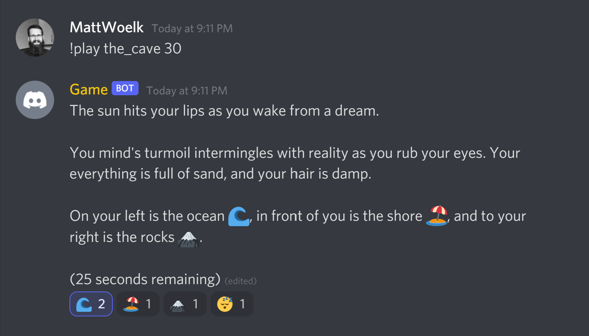

# Discord Story Bot



Goals:

v0.2

- [x] basic story features
- [x] show options and associated text
- [x] images and other attachments
- [x] play only one game at a time, and have a stop command
- [x] timer tools
  - [x] support time scales that are larger than one minute (time formatting)
  - [x] and tick the timer appropriately depending on time-scale.
  - [x] and have a way to set these when playing a story
- [x] stories as their own directories, automatically imported
- [x] hide test stories, or make them their own category

v1.0

- [x] put the title and author as bold in the initial message
- [x] grab the story title from the tag (if there is one)
  - display this in the `!play` list, but still use the filename as they key
- [ ] emoji validation
- [ ] verify that filenames don't have spaces in them, or other bad special characters
- [ ] error handling with messages (when applicable) to the user, otherwise nice logs
- [ ] restart from the middle
- [ ] pause/resume commands
- [ ] variables, logic, and conditionals
- [ ] generate text from data, for example a health bar made of heart emojis. Maybe ink can do this without special code though, so we'll see.

v2.0

- [ ] a way to show which options you would have had, but are unavailable, so people want to play again.
  -  maybe this is a summary of the game, or saying "X branches were not taken", or "found 3/5 endings".

See [the runner readme](runner/README.md) to see which parts of the .ink format are supported.


## How to make a story

You'll be writing a `.ink` file using the ink language. See [their documentation](https://www.inklestudios.com/ink/) for details. Go there and download their `Inky` tool, which you'll use for testing your story.

Not every feature of ink is supported by the bot. See the current [support status here](runner/README.md).

Your choices need to start with a [discord-supported emoji](https://emojipedia.org/twitter/twemoji-12.1.4/) ([more information](https://emojipedia.org/discord/)). See the [stories directory](stories) for examples.

You can add images using the `#img:image.jpg` tag. See [the images example](stories/images/images.ink).

Put your images and .ink files in a directory together, like in the examples in the [stories directory](stories), and the bot will automatically find them when you deploy it (see below).


## Tips

- You can set permissions in the channel that your bot is in so that **people cannot add emoji reactions** unless your bot does first.
- You **set stories as hidden** so they don't show up in the `!play` list using the `# hidden` tag at the top of the file.
- You can either make your emoji reactions **more explicit** by adding text to them, like in [story1](stories/story1/story1.ink), or you can make them **more mysterious** by removing the prompt altogether with the `# hide_choices` tag at the top of the file, like in [the_cave](stories/the_cave/the_cave.ink).
- Put the **author and title** at the top of your stories, so you get credit for them: `# author: Your Name`, `# title: Story Title`.


## Deployment

### To run locally:

Run `cargo run -- -help`, which will tell you do to something like `cargo run -- client_ids/client_id.txt`.

### For cross-compiling from WSL/ubuntu to raspberry pi:

Run these:

`rustup target add arm-unknown-linux-gnueabi`

`sudo apt install build-essential`

`sudo apt install gcc-arm-linux-gnueabi`

Set up ssh keys with your raspberry pi, so you don't have to type your password many times.

Make this file (with sudo) `/lib/systemd/system/discord-story-bot.service`, with these contents:

```
[Unit]
Description=Discord Story Bot
After=multi-user.target

[Service]
WorkingDirectory=/home/pi
ExecStart=/home/pi/discord_story_bot client_ids/client_id.txt
Restart=always
RestartSec=10s

[Install]
WantedBy=multi-user.target
```

Then run `./deploy_to_raspberry_pi` (but modify it first so that it matches your raspberry pi's ip address, etc. Also, note that you may want to set up your router so your raspberry pi always has the same ip address.)


## Running

To see all the instructions you can give, run `!help` in a discord channel that has this bot running in it.

Run `!play` to see a list of stories that are available, and instructions for how to run one.

The key in that list is the filename of the story (without `.ink`), and it will show the title and author as well if those tags are available in your story.